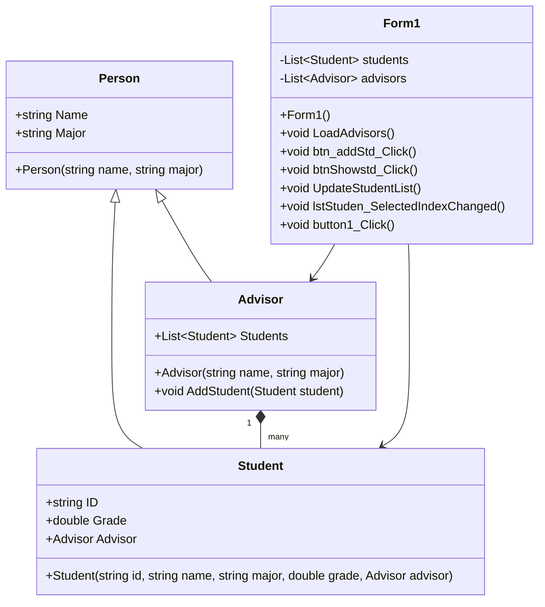

## จัดทำโดย
- ชื่อ: นาย ธีรเดช ประสารสุข
- รหัสนักศึกษา:673450195-4

## โครงสร้างโปรแกรม
1. `Student` Class - บันทึกข้อมูลนักศึกษา
2. `Advisor` Class - บันทึกอาจารย์ที่ปรึกษา
3. `main.py` - ทดสอบการทำงานของระบบ

## หลักการ OOP ที่ใช้
✅ **Encapsulation**: ใช้ตัวแปร `__` ป้องกันการแก้ไขค่าจากภายนอก  
✅ **Abstraction**: ซ่อนรายละเอียดการทำงานของคลาส  
✅ **Polymorphism**: ใช้ `getInfo()` ให้ทุกคลาสแสดงข้อมูลในรูปแบบเดียวกัน  
✅ **Inheritance**: (หากมีการเพิ่มคลาสย่อย สามารถใช้การสืบทอดคลาสได้)
 

# Student-Advisor Management System

This project is a simple Student-Advisor management system using Object-Oriented Programming (OOP) principles such as Encapsulation, Abstraction, Polymorphism, and Inheritance.

## Class Diagram

## Features
- Add and display student details
- Assign advisors to students
- Show the top student based on grades
- Manage advisor list dynamically

## Getting Started
1. Clone the repository
2. Open the project in Visual Studio
3. Run the application and manage student-advisor relationships

## Technologies Used
- C#
- Windows Forms (WinForms)
- Object-Oriented Programming (OOP)

## License
This project is licensed under the MIT License.

