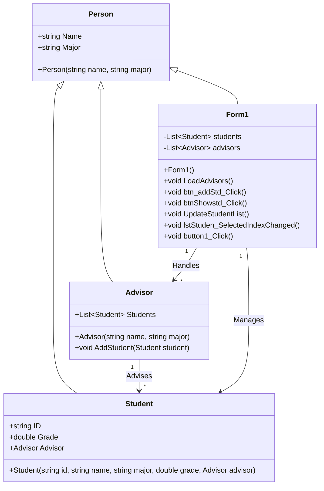

## จัดทำโดย
- ชื่อ: นาย ธีรเดช ประสารสุข
- รหัสนักศึกษา:673450195-4

## โครงสร้างโปรแกรม
1. **Person (Superclass)** – เป็นคลาสหลักที่ใช้สืบทอดให้กับ Student และ Advisor  
2. **Student (Subclass)** – ใช้เก็บข้อมูลนักศึกษา  
3. **Advisor (Subclass)** – ใช้เก็บข้อมูลอาจารย์ที่ปรึกษา  
4. **Form1 (UI Class)** – ใช้สำหรับจัดการ UI ของโปรแกรม

## คุณสมบัติ (Features)
- เพิ่มและแสดงรายละเอียดของนักศึกษา
- กำหนดอาจารย์ที่ปรึกษาให้กับนักศึกษา
- เพิ่มอาจารย์ได้เลยโดยไม่ต้องเขียนโปรแกรมใหม่
- แสดงนักศึกษาที่มีเกรดสูงสุด
- จัดการรายชื่ออาจารย์ที่ปรึกษาแบบไดนามิก

# ระบบจัดการข้อมูลนักศึกษาและอาจารย์

โปรแกรมนี้พัฒนาเพื่อจัดการข้อมูลนักศึกษาและอาจารย์ โดยใช้หลักการเขียนโปรแกรมเชิงวัตถุ (OOP) เพื่อให้โปรแกรมมีโครงสร้างที่ดีและง่ายต่อการดูแลรักษา

## ฟีเจอร์

- **เพิ่มนักศึกษา**: สามารถเพิ่มข้อมูลนักศึกษา เช่น รหัสนักศึกษา ชื่อ ภาควิชา เกรด และอาจารย์ที่ปรึกษา
- **กำหนดอาจารย์ที่ปรึกษา**: ผู้ใช้สามารถเลือกอาจารย์จากรายการที่มี และกำหนดให้อาจารย์ดูแลนักศึกษา
- **แสดงนักศึกษาที่มีเกรดสูงสุด**: แสดงนักศึกษาที่มีเกรดสูงที่สุด
- **เพิ่มอาจารย์**: ผู้ดูแลระบบสามารถเพิ่มข้อมูลอาจารย์ใหม่ได้

 ## design

## Class Diagram

## หลักการเขียนโปรแกรมเชิงวัตถุ (OOP)

โปรแกรมนี้ใช้หลักการเขียนโปรแกรมเชิงวัตถุ (OOP) สี่หลักการ ได้แก่:

### 1. **Encapsulation (การห่อหุ้ม)**

- ข้อมูลที่เกี่ยวข้องกับนักศึกษาและอาจารย์จะถูกห่อหุ้มไว้ในคลาส `Student`, `Advisor`, และ `Person` ซึ่งช่วยให้ข้อมูลนี้ถูกปกป้องและเข้าถึงได้ผ่านเมธอดต่างๆ ที่กำหนดไว้ เช่น `AddStudent()` สำหรับการเพิ่มนักศึกษาในอาจารย์
- ข้อมูล เช่น `Name`, `Major`, `Grade`, และ `Advisor` จะถูกเก็บไว้ในฟิลด์ของคลาส และสามารถเข้าถึงหรือแก้ไขได้ผ่านการเรียกเมธอดที่กำหนด เช่น `AddStudent()`, `GetStudentInfo()`

### 2. **Abstraction (การทำให้เป็นนามธรรม)**

- คลาส `Person` ทำหน้าที่เป็นคลาสฐานสำหรับทั้ง `Student` และ `Advisor` ซึ่งช่วยให้การใช้งานทั้งสองประเภทเป็นนามธรรม กล่าวคือ รายละเอียดภายในคลาส `Person` (เช่น `Name` และ `Major`) จะถูกซ่อนอยู่จากผู้ใช้โปรแกรม
- ผู้ใช้โปรแกรมไม่จำเป็นต้องรู้วิธีการทำงานของคลาส `Person` แต่สามารถใช้ข้อมูลที่สำคัญได้ง่ายๆ เช่น `student.Name`, `advisor.Name`

### 3. **Polymorphism (ความหลายหลายรูปแบบ)**

- แม้ว่าคลาส `Student` และ `Advisor` จะสืบทอดมาจาก `Person` แต่การใช้งาน `Person` จะสามารถมีหลายรูปแบบ เช่น เมธอดที่สามารถทำงานกับทั้ง `Student` และ `Advisor` ได้ เช่น การแสดงชื่อหรือข้อมูลทั่วไป
- นอกจากนี้ยังสามารถสร้างฟังก์ชันที่ทำงานกับชนิดข้อมูล `Person` และแสดงผลที่แตกต่างกันตามประเภทของออบเจ็กต์ที่ถูกใช้งาน เช่น แสดงข้อมูลของนักศึกษาและอาจารย์

### 4. **Inheritance (การสืบทอด)**

- คลาส `Student` และ `Advisor` สืบทอดคุณสมบัติจากคลาส `Person` ซึ่งช่วยลดการทำซ้ำในโค้ด (code reuse) และทำให้โปรแกรมมีโครงสร้างที่สะอาดและง่ายต่อการดูแลรักษา
- คลาส `Student` และ `Advisor` ใช้คุณสมบัติที่สืบทอดมาจาก `Person` เช่น `Name` และ `Major` และสามารถเพิ่มคุณสมบัติพิเศษของตัวเอง เช่น `ID`, `Grade` สำหรับ `Student`, และ `Students` สำหรับ `Advisor`

## สรุป  
✅ ใช้ OOP Concepts (Encapsulation, Inheritance, Polymorphism, Abstraction)  
✅ มี Class Diagram ที่แสดงโครงสร้างและความสัมพันธ์ของคลาส  
✅ สามารถจัดการข้อมูล นักศึกษาและอาจารย์ที่ปรึกษา ได้ผ่าน UI  

