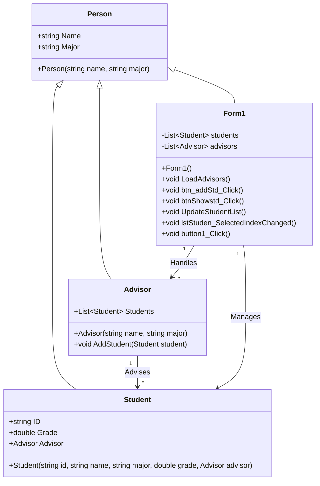

## จัดทำโดย
- ชื่อ: นาย ธีรเดช ประสารสุข
- รหัสนักศึกษา:673450195-4

## โครงสร้างโปรแกรม
1. **Person (Superclass)** – เป็นคลาสหลักที่ใช้สืบทอดให้กับ Student และ Advisor  
2. **Student (Subclass)** – ใช้เก็บข้อมูลนักศึกษา  
3. **Advisor (Subclass)** – ใช้เก็บข้อมูลอาจารย์ที่ปรึกษา  
4. **Form1 (UI Class)** – ใช้สำหรับจัดการ UI ของโปรแกรม

## คุณสมบัติ (Features)
- เพิ่มและแสดงรายละเอียดของนักศึกษา
- กำหนดอาจารย์ที่ปรึกษาให้กับนักศึกษา
- แสดงนักศึกษาที่มีเกรดสูงสุด
- จัดการรายชื่ออาจารย์ที่ปรึกษาแบบไดนามิก

## หลักการ OOP ที่ใช้
✅ **Encapsulation**: ใช้ตัวแปร `__` ป้องกันการแก้ไขค่าจากภายนอก  
✅ **Abstraction**: ซ่อนรายละเอียดการทำงานของคลาส  
✅ **Polymorphism**: ใช้ `getInfo()` ให้ทุกคลาสแสดงข้อมูลในรูปแบบเดียวกัน  
✅ **Inheritance**: (หากมีการเพิ่มคลาสย่อย สามารถใช้การสืบทอดคลาสได้)
 

## Class Diagram

